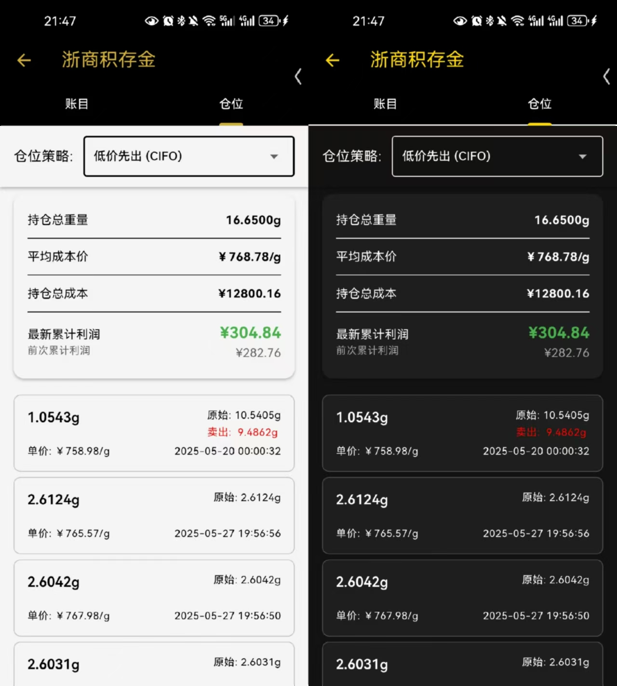

# 金豆夹 GoldPod

## 简介 Introduction
这是一款移动端极简黄金交易账目管理 App! 所有账目均在本地管理，即开即用，1s启动！支持白天/黑夜模式，睁眼闭眼就是猛猛抄底!

<figure style="text-align: center;">
  
  <figcaption style="text-align:center; font-size:0.9em;">
    主页 Home
  </figcaption>
</figure>

## 功能特色 Feature
1. 支持多个独立账本，分别管理不同平台账目；
<figure style="text-align: center;">
  
  <figcaption style="text-align:center; font-size:0.9em;">
    账簿细分 Notebook
  </figcaption>
</figure>

<figure style="text-align: center;">
  
  <figcaption style="text-align:center; font-size:0.9em;">
    账目详情 Transaction
  </figcaption>
</figure>

4. [🐥亮点功能 1] 支持对账本内的成交记录按照多种策略进行持仓管理：
① 先入先出：即时间上先买入的被先卖出
② 后入先出：即时间上后买入的被先卖出
③ 低价先出：即买入价低的被先卖出
④ 高价先出：即买入价高的被先卖出
⑤ 均摊卖出：即每次卖出均按照历史买入金额成比例卖出，亦即平均成本只与买入有关，卖出直接从总克数减去；

<figure style="text-align: center;">
  
  <figcaption style="text-align:center; font-size:0.9em;">
    策略选择 Strategy
  </figcaption>
</figure>

5. [🐥亮点功能 2] 支持对账本内的持仓情况提供总揽，包括持仓总重量、平均成本价、持仓总成本、最新累计利润、前次累计利润，轻松获取自己当前成交是否赚钱！

<figure style="text-align: center;">
  
  <figcaption style="text-align:center; font-size:0.9em;">
    仓位概览 Inventory
  </figcaption>
</figure>

## 下载方式

途径 1: [Github Release](https://github.com/Beta-y/GoldPod/releases)

途经 2 (国内): [Gitee Release](https://gitee.com/beta-y/GoldPod/releases)

途经 3 (国内): [夸克网盘 Quark Pan](https://pan.quark.cn/s/4677fb555e63)